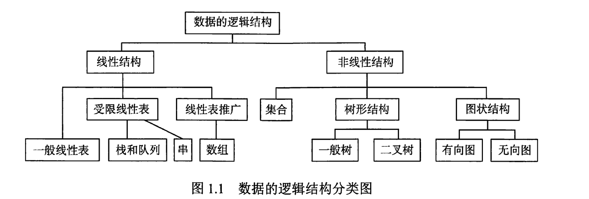

## 1.1 数据结构的基本概念

### 1.1.1 基本概念和术语

1.   **数据**

数据是信息的载体，是描述客观事物属性的数、字符及所有能输入到计算机中并被计算机程序识别和处理的符号的集合。数据是计算机程序加工的原料。

2.   **数据元素**

     数据元素是数据的基本单位，通常作为一个整体进行考虑和处理。一个数据元素可由若干数据项组成，数据项是构成数据元素的不可分割的最小单位。

3.   **数据对象**

     数据对象是具有相同性质的数据元素的集合，是数据的一个子集。例如，整数数据对象是集合$N = {0, ±1，±2}$

4.   **数据类型**

     数据类型是一个值的集合和定义在此集合上的一组操作的总称

     -   原子类型。其值不可再分的数据类型
     -   结构类型。其值可以再分解为若干成分（分量）的数据类型
     -   抽象数据类型。抽象数据组织及与之相关的操作

5.   **数据结构**

     数据结构是相互之间存在一种或多种特定关系的数据元素的集合。在任何问题中，数据元素都不是孤立存在的，它们之间存在着某种关系，这种数据元素相互之间的关系称为结构(Structure)。数据结构包括三方面的内容：逻辑结构、存储结构和数据的运算

### 1.1.2 数据结构三要素

1.   **数据的逻辑结构**

     

2.   **数据的存储结构**

​	存储结构是指数据结构在计算机中的表示，也称物理结构。它包括数据元素的表示和关系的表示。数据的存储结构是用计算机语言实现的逻辑结构，它依赖于计算机语言。数据的存储结构主要有顺序存储、链式存储、索引存储和散列存储。

