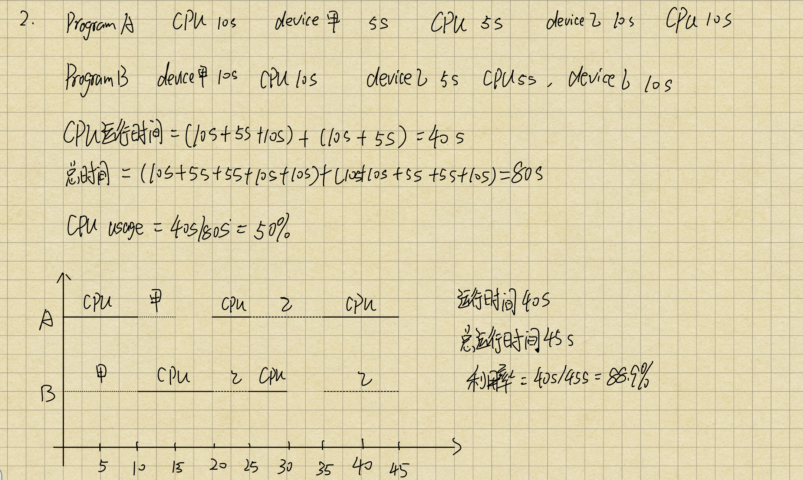

## 1.2 操作系统发展历程

### 1.2.1 手工操作阶段

手工操作阶段有两个缺点：用户独占全机，虽然不会出现因资源已被其他用户占用而等待的现象，但资源利用率低；CPU等待手工操作，CPU的利用不充分

### 1.2.2 批处理阶段

1.   **单道批处理系统**

     单道批处理系统是在解决人机矛盾及CPU和I/O设备速率不匹配的矛盾中形成的。单道批处理系统的主要特征如下：

     -   自动性：在顺利的情况下，磁带上的一批作业能自动地逐个运行，无需人工干预。
     -   顺序性：磁带上的各道作业顺序地进入内存，各道作业的完成顺序与它们进入内存的顺序在正常情况下完全相同，亦即先调入内存的作业先完成。
     -   单道性：内存中仅有一道程序运行，即监督程序每次从磁带上只调入一道程序进入内存运行，当该程序完成或发生异常情况时，才换入其后继程序进入内存运行。

2.   **多道批处理系统**

     多道程序设计技术允许多个程序同时进入内存并允许它们在CPU中交替地运行，这些程序共享系统中的各种硬/软件资源。

     多道程序设计的特点是**多道**、**宏观上并性**、**微观上串行**。

     多道程序设计技术的实现需要解决下列问题：如何分配处理器、多道程序的内存分配问题、I/O设备如何分配、如何组织和存放大量的程序和数据，以方便用户使用并保证其安全性与一致性。

     优点：资源利用率高，多道程序共享计算机资源，从而使各种资源得到充分利用；系统吞吐量大，CPU和其他资源保持“忙碌”状态。缺点：用户响应的时间较长；不提供人机交互能力，用户既不能了解自己的程序的运行情况，又不能控制计算机。

### 1.2.3 分时操作系统

分时技术是指把处理器的运行时间分成很短的**时间片**，按时间片轮流把处理器分配给各联机作业使用。分时操作系统是指多个用户通过终端同时共享一台主机，这些终端连接在主机上，用户可以同时与主机进行交互操作而互不干扰。分时系统支持多道程序设计的系统，但是又和多道批处理系统。多道批处理是实现作业自动控制而无须人工干预的系统，而分时系统是实现人机交互的系统，这使得分时系统具有与批处理系统不同的特征。

分时系统的主要特征如下：

-   **同时性**：又称为多路性，指允许多个终端用户同时使用一台计算机，即一台计算机与若干台终端相连接，终端上的这些用户可以同时或基本同时使用计算机。
-   **交互性**：用户能够方便地与系统进行人机对话，即用户通过终端采用人机对话的方式直接控制程序运行，与同程序进行交互。
-   **独立性**：系统中多个用户可以彼此独立地进行操作，互不干扰。
-   **及时性**：用户请求能在很短时间内获得响应。

### 1.2.4 实时操作系统

**硬实时操作系统**：若某个动作必须绝对地在规定的时刻发生，如飞行器的飞行自动控制系统，系统必须提供绝对保证，让某个特定的动作在规定的时间内完成。若偶尔可以违反时间规定，称为**软实时操作系统**，如飞机订票系统，银行管理系统。

主要特点：及时性、可靠性

### 1.2.5 网络操作系统和分布式计算机系统

**网络操作系统**把计算机网络中的各台计算机有机地结合起来，提供一种统一、经济而有效的使用各台计算机的方法，主要特点：网络中各种资源的共享及各台计算机之间的通信

**分布式计算机系统**是由多台计算机组成并满足下列条件的系统：任意两台计算机通过通信方式交换信息；每台计算机具有同等地位；资源共享；任意台计算机可以构成子系统，可以重构；工作可以并性在多台计算机上。主要特点：分布性、并行性。

### 1.2.6 个人计算机操作系统

Windows、macOS、Linux

### 1.2.7 课后习题

#### 选择题

5.   实时操作系统必须在( )内处理来自外部的事件

     A. 一个机器周期		B.被控制对象规定时间		C.周转时间		D.时间片

     

​	B，实时操作系统要求能实时处理外部事件，即在规定的时间内完成对外部事件的处理。

14.   下列关于批处理系统的叙述中，正确的是( )

      ​	Ⅰ. 批处理系统允许多个用户与计算机直接交互

      ​	Ⅱ. 批处理系统分为单道批处理系统和多道批处理系统

      ​	Ⅲ. 中断技术使得多道批处理系统的I/O设备可与CPU并行工作

      A.Ⅱ、Ⅲ			B.Ⅱ			C.Ⅰ、Ⅱ		D.Ⅰ、Ⅲ

A，批处理系统中，作业执行时用户无法干预其运行，只能通过事先编制作业控制说明书来间接干预，缺少交互能力，也因此才发展出分时操作系统，即说法1错误。

#### 综合应用题

1.   批处理操作系统、分时操作系统和实时操作系统各有什么特点

​		批处理操作系统的用户脱机使用计算机，作业是成批处理的，系统内多道程序并发执行，交互能力差

​		分时操作系统可让多个用户同时使用计算机，人机交互性较强，具有每个用户独立使用计算机的独占性，系统响应及时。

​		实时操作系统能对控制对象做出及时反应，可靠性高，响应及时，但资源利用率低。

2.   有两个程序，程序A依次使用CPU计10s、设备甲计5s、CPU计5s、设备乙计10s、CPU计10s；程序B依次使用设备甲计10s、CPU计10s、设备乙计5s、CPU计5s、设备乙计10s。在单道程序环境下先执行程序A再执行程序B，CPU利用率是多少？在多道程序环境下，CPU利用率是多少？

​		

​		

3.   设某计算机系统有一个CPU、一台输入设备、一台打印机。现有两个进程同时进入就绪态，且进程A先得到CPU运行，进程B后运行。进程A的运行轨迹为：计算50ms,打印信息100ms，再计算50ms，打印信息100ms，结束。进程B的运行轨迹为：计算50ms，输入数据80ms，再计算100ms，结束。画出它们的甘特图，并说明。

​		1）开始运行后，CPU有无空闲等待？若有，在哪段时间内等待？计算CPU的利用率

​		2）进程A运行时有无等待现象？若有，在何时发生等待现象？

​		3）进程B运行时有无等待现象？若有，在何时发生等待现象？

