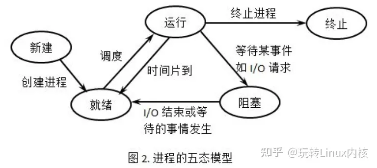

## 2.1 进程与线程

### 2.1.1 进程的概念和特征

1.   **进程的概念**

     为了允许多个程序并发执行，引入进程概念，进程可以更好地描述和控制程序的并发执行，实现操作系统的并发性和共享性。

     进程控制块PCB是用来描述进程的基本情况和运行状态，进而控制和管理进程。

     程序段、相关数据段和PCB三部分构成了进程实体(进程映像)。创建进程就是创建进程实体中的PCB；撤销进程就是撤销进程的PCB。

     

2.   **进程的特征**

     进程和程序是两个不同的概念，进程的基本特征有以下几个：

     -   动态性。进程是程序的一次执行，它有着创建、活动、暂停、终止等过程，具有一定的生命周期，是动态地产生、变化和消亡的。动态性是进程最基本的特征。
     -   并发性。指多个进程实体同存于内存中，能在一段时间内同时允许。引入进程的目的就是使进程能和其他进程并发执行。并发性是进程的重要特征，也是操作系统的重要特征。
     -   独立性。指进程实体是一个能独立运行、独立获得资源和独立接受调度的基本单位。
     -   异步性。由于进程的相互制约，使得进程按各自独立的、不可预知的速度向前推进。

### 2.1.2 进程的状态与转换

-   运行态。进程正在处理机上运行。
-   就绪态。进程获得除了处理机外的一切所需资源，一旦得到处理机，便可立即运行。
-   阻塞态。进程正在等待某一事件而暂停运行，如等待某资源为可用或等待输入/输出完成。即使处理机空闲，该进程也不能运行。系统通常将处于阻塞态的进程也排成一个队列，甚至根据阻塞原因的不同，设置多个阻塞队列。
-   创建态。进程正在被创建，尚未转到就绪态。创建进程需要多个步骤：首先申请一个空白PCB，并向PCB中填写用于控制和管理进程的信息；然后为该进程分配运行时所必须的资源；最后把该进程转入就绪态并插入就绪队列。
-   终止态。进程正从系统中消失，可能是进程正常结束或其他原因退出运行。进程需要结束运行时，系统首先将该进程置为终止态，然后进一步处理资源释放和回收等工作。

-   就绪态-->运行态：处于就绪态的进程被调度后，获得处理机资源，于是进程由就绪态转换为运行态。
-   运行态-->就绪态：处于运行态的进程在时间片用完后，不得不让出处理机，从而进程由运行态转换为就绪态。
-   运行态-->阻塞态：进程请求某一资源的使用和分配或等待某一事件的发生时，它就从运行态转换为阻塞态。
-   阻塞态-->就绪态：进程等待的事件到来时，如I/O操作结束或中断结束时，中断处理程序必须把相应进程的状态由阻塞态转换为就绪态。

### 2.1.3 进程的组成

进程是一个独立的运行单位，也是操作系统进行资源分配和调度的基本单位。

1.   进程控制块

     进程创建时，操作系统为它新建一个PCB，然后常驻内存，在进程结束时删除。PCB是进程实体的一部分，是进程存在的唯一标志。

     下表为PCB的一个实例

     | 进程描述信息    | 进程控制和管理信息 | 资源分配清单 | 处理机相关信息 |
     | --------------- | ------------------ | ------------ | -------------- |
     | 进程标识符(PID) | 进程当前状态       | 代码段指针   | 通用寄存器值   |
     | 用户标识符(UID) | 进程优先级         | 数据段指针   | 地址寄存器值   |
     |                 | 代码运行入口地址   | 堆栈段指针   | 控制寄存器值   |
     |                 | 程序的外存地址     | 文件描述符   | 标志寄存器值   |
     |                 | 进入内存时间       | 键盘         | 状态字         |
     |                 | 处理机占用时间     | 鼠标         |                |
     |                 | 信号量使用         |              |                |

     1）进程描述信息。进程标识符：标志各个进程，每个进程都有一个唯一的标识号。用户标识符：进程归属的用户，用户标识符主要为共享和保护服务。

     2）进程控制和管理系你行。进程当前状态：描述进程的状态信息，作为处理机分配调度的依据。进程优先级：描述进程抢占处理机的优先级，优先级高的进程可优先获得处理机。

     3）资源分配清单，用于说明有关内存地址空间或虚拟地址空间的状况，所打开文件的列表和所使用的输入/输出设备信息。

     4）处理机相关信息，也称为处理机的上下文，主要指处理机中各寄存器的值。当进程处于执行态时，处理机的许多信息都在寄存器中。当进程被切换时，处理机状态信息都必须保存在相应的PCB中，以便在该进程重新执行时，能从断点继续执行。

     

2.   程序段

     程序段就是能被进程调度程序调度到CPU执行的程序代码段；

3.   数据段

     一个进程的数据段，可以是进程对应的程序加工处理的原始数据，也可以是程序执行时产生的中间或最终结果。

### 2.1.4 进程控制

进程控制的主要功能是对系统中的所有进程实施有效的管理，它具有创建新进程、撤销已有进程、实现进程状态转换等功能。在操作系统中，一般把进程控制用的程序称为原语，原语的特点是执行期间不允许中断，它是一个不可分割的基本单位。

1.   **进程的创建**

     允许一个进程创建另一个进程，此时创建者称为父进程，被创建的进程称为子进程。子进程可以继承父进程所拥有的资源。当子进程被撤销时，应将其从父进程那里获得的资源归还给父进程。

     在操作系统中，终端用户登陆系统、作业调度、系统提供服务、用户程序的应用请求等都会引起进程的创建。接下来是创建原语:

     1）为进程分配一个唯一的进程标识号，并申请一个空白的PCB。若PCB申请失败，则创建失败。

     2）为进程分配其运行所需的资源，如内存、文件、I/O设备和CPU时间等。这些资源或从操作系统获得，或仅从父进程获得。如果资源不足，则并不是创建失败，而是处于创建态，等待内存资源。

     3）初始化PCB，主要包括初始化标志信息、初始化处理机状态信息和初始化处理机控制信息，以及设置进程的优先级等。

     4）若进程就绪队列能够接纳新进程，则将新进程插入就绪队列，等待被调度运行。

2.   **进程的终止**

     引起进程终止的事件主要有：正常结束，表示进程的任务已完成并准备退出运行。异常结束，表示进程在运行时，发生了某种事件，使程序无法继续运行，如存储区越界、保护错、非法指令、特权指令错、运行超时、算术运算错、I/O故障等。外界干预，指进程应外界的请求而终止运行，如操作员或操作系统干预、父进程请求和父进程终止。

     操作系统终止进程的过程如下：

     1）根据被终止进程的标识符，检索出该进程的PCB，从中读出该进程的状态

     2）若被终止进程处于运行状态，立即终止该进程的执行，将处理机资源分配给其他进程

     3）若该进程